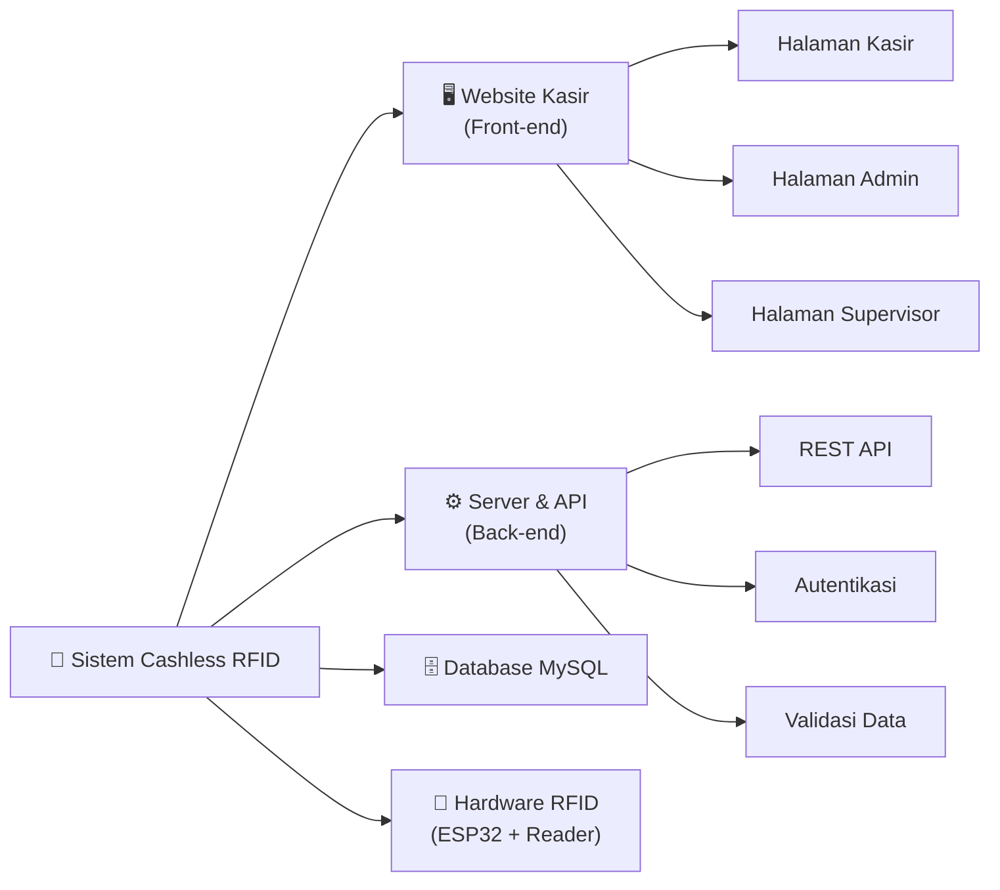
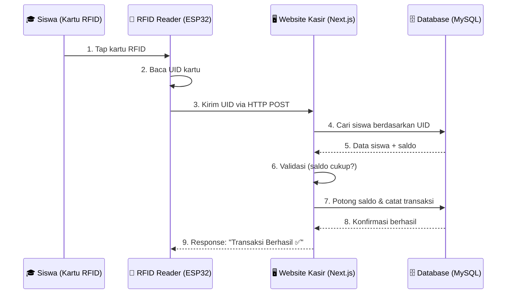
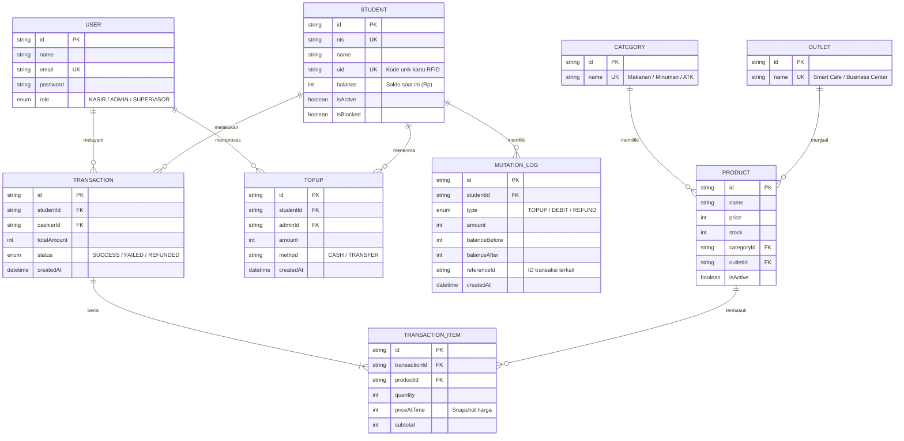
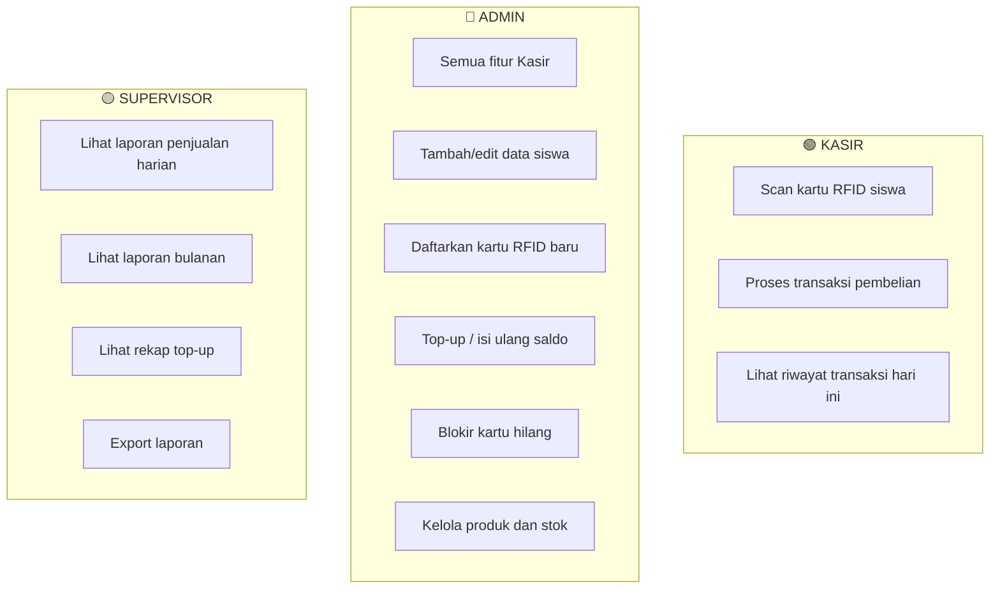
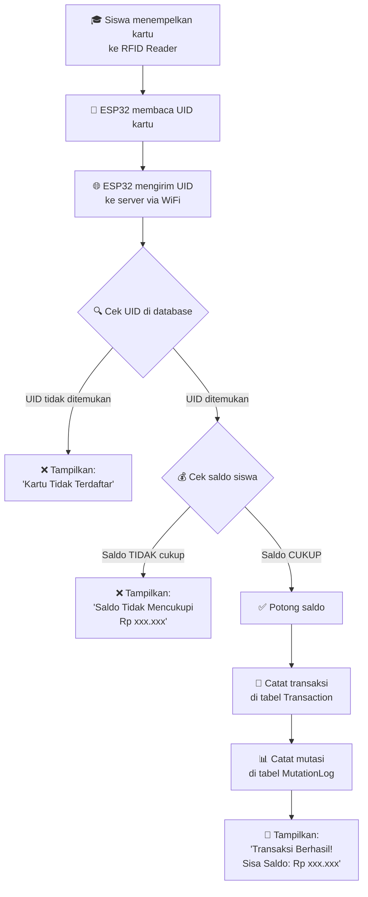
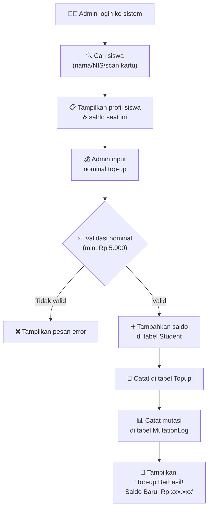

# 📊 Slide Presentasi — Sistem Kasir Cashless Berbasis RFID

> **Panduan:** Dokumen ini disusun per-slide. Setiap bagian `---` adalah pemisah antar slide.
> Kamu bisa langsung salin isi tiap slide ke dalam PowerPoint, Google Slides, atau Canva.

---

## 📌 SLIDE 1 — Halaman Judul

### SISTEM KASIR CASHLESS BERBASIS KARTU RFID
**Untuk Business Center & Smart Cafe Sekolah**

| | |
|---|---|
| **Mata Pelajaran** | Projek Kreatif dan Kewirausahaan / Projek Akhir |
| **Jurusan** | PPLG (Pengembangan Perangkat Lunak dan Gim) |
| **Tahun** | 2026 |

> *Catatan: Sesuaikan nama sekolah, anggota tim, dan guru pembimbing.*

---

## 📌 SLIDE 2 — Latar Belakang Masalah

### ❓ Mengapa Proyek Ini Dibuat?

Permasalahan yang ditemui di lingkungan sekolah saat ini:

| No | Masalah | Dampak |
|----|---------|--------|
| 1 | Siswa membawa **uang tunai** ke sekolah | Rawan hilang, dicuri, atau tercecer |
| 2 | Antrian panjang saat jam istirahat | Proses pembayaran tunai lambat (hitung kembalian) |
| 3 | Pencatatan transaksi **masih manual** | Sulit diaudit, rawan kesalahan hitung |
| 4 | Tidak ada **riwayat transaksi** digital | Orang tua tidak bisa memantau pengeluaran anak |

> **💡 Solusi:** Membangun sistem kasir digital (cashless) berbasis kartu RFID yang sudah dimiliki siswa (kartu pelajar).

---

## 📌 SLIDE 3 — Tujuan Proyek

### 🎯 Tujuan

1. **Menghilangkan penggunaan uang tunai** di kantin dan Business Center sekolah.
2. **Mempercepat proses transaksi** — cukup *tap* kartu, selesai dalam hitungan detik.
3. **Mencatat seluruh transaksi secara otomatis** ke dalam database sehingga mudah diaudit.
4. **Menyediakan laporan keuangan** harian/bulanan untuk pihak sekolah.
5. **Meningkatkan keamanan** — uang siswa tersimpan secara digital, bukan fisik.

---

## 📌 SLIDE 4 — Ruang Lingkup Sistem

### 📦 Apa Saja yang Termasuk dalam Sistem Ini?



> **Catatan:** Tim kami bertanggung jawab atas bagian **Website Kasir (Front-end, Back-end, Database)**. Bagian Hardware (ESP32 + RFID Reader) dikerjakan oleh tim lain.

---

## 📌 SLIDE 5 — Arsitektur Sistem

### 🏗️ Bagaimana Semua Komponen Terhubung?



**Penjelasan singkat:**
- Kartu RFID hanya menyimpan **UID (kode unik)** — BUKAN saldo.
- **Saldo disimpan dengan aman di server database.**
- Jika kartu hilang, admin cukup blokir kartu lama dan daftarkan kartu baru. Saldo tetap aman.

---

## 📌 SLIDE 6 — Teknologi yang Digunakan (Tech Stack)

### 🛠️ Tech Stack

| Layer | Teknologi | Versi | Fungsi |
|-------|-----------|-------|--------|
| **Framework** | Next.js (React) | 14.2 | Membangun tampilan (UI) sekaligus server (API) dalam 1 proyek |
| **Bahasa** | TypeScript | 5.x | JavaScript + tipe data statis → lebih aman dari bug |
| **Styling** | Tailwind CSS | 4.x | Framework CSS modern untuk desain responsif & cepat |
| **Database** | MySQL | 8.x | Database relasional untuk menyimpan data transaksi |
| **ORM** | Prisma | 5.x | Penghubung kode TypeScript ↔ database tanpa SQL manual |
| **Auth** | NextAuth.js | 4.x | Sistem login multi-role (Kasir, Admin, Supervisor) |
| **Validasi** | Zod | 3.x | Validasi input data dari pengguna |
| **Enkripsi** | bcryptjs | 2.x | Mengenkripsi password pengguna agar tidak bisa dibaca |
| **Hardware** | ESP32 + MFRC522 | — | Mikrokontroler + modul pembaca kartu RFID Mifare |

---

## 📌 SLIDE 7 — Mengapa Memilih Tech Stack Ini?

### 🤔 Alasan Pemilihan Teknologi

| Pertanyaan | Jawaban |
|------------|---------|
| **Kenapa Next.js?** | Full-stack (frontend + backend) dalam 1 proyek. Tidak perlu membuat 2 proyek terpisah. Sudah mendukung API Routes, sehingga tidak perlu Express.js tambahan. |
| **Kenapa TypeScript?** | Mendeteksi kesalahan (bug) sejak saat menulis kode, sebelum program dijalankan. Sangat membantu saat proyek semakin besar. |
| **Kenapa MySQL?** | Database yang umum dipelajari di SMK. Cocok untuk data transaksional (keuangan) karena mendukung relasi antar tabel dengan baik. |
| **Kenapa Prisma?** | Tidak perlu menulis query SQL manual yang panjang. Cukup tulis kode TypeScript dan Prisma yang akan menerjemahkannya ke SQL. |
| **Kenapa Tailwind CSS?** | Membuat tampilan web yang responsif (cocok di HP maupun laptop) dengan sangat cepat tanpa perlu membuat file CSS terpisah. |

---

## 📌 SLIDE 8 — Struktur Database (ERD)

### 🗄️ Entity Relationship Diagram



---

## 📌 SLIDE 9 — Penjelasan Tabel Database

### 📋 Detail 9 Tabel Utama

| No | Tabel | Jumlah Kolom | Fungsi |
|----|-------|:---:|--------|
| 1 | **User** | 7 | Menyimpan data petugas (Kasir, Admin, Supervisor) yang bisa login ke sistem |
| 2 | **Student** | 9 | Menyimpan profil siswa, UID kartu RFID, dan **saldo terkini** |
| 3 | **Category** | 2 | Kategori produk (Makanan, Minuman, ATK, dll.) |
| 4 | **Outlet** | 2 | Lokasi penjualan (Smart Cafe / Business Center) |
| 5 | **Product** | 8 | Daftar produk/menu beserta harga dan stok |
| 6 | **Transaction** | 7 | Mencatat setiap transaksi pembelian yang terjadi |
| 7 | **TransactionItem** | 6 | Detail produk dalam 1 transaksi (seperti struk belanja) |
| 8 | **Topup** | 6 | Mencatat setiap pengisian saldo oleh Admin |
| 9 | **MutationLog** | 8 | Jejak audit (log) setiap perubahan saldo — untuk keamanan |

> **💡 Catatan penting:** Kolom `priceAtTime` di TransactionItem menyimpan *snapshot* harga saat transaksi terjadi. Jadi meskipun harga produk berubah di kemudian hari, riwayat transaksi tetap akurat.

---

## 📌 SLIDE 10 — Fitur per Role (Hak Akses)

### 👥 Pembagian Hak Akses Pengguna



| Role | Siapa? | Bisa Apa? |
|------|--------|-----------|
| **Kasir** | Petugas kantin / Business Center | Melayani pembayaran siswa |
| **Admin** | Petugas TU / Admin sekolah | Mendaftarkan siswa, isi saldo, kelola produk |
| **Supervisor** | Guru / Kepala Sekolah | Melihat dan mengunduh laporan keuangan |

---

## 📌 SLIDE 11 — Alur Kerja Transaksi (Pembelian)

### 🛒 Flowchart: Proses Pembelian



---

## 📌 SLIDE 12 — Alur Kerja Top-Up (Isi Saldo)

### 💳 Flowchart: Proses Isi Ulang Saldo



---

## 📌 SLIDE 13 — Keamanan Sistem

### 🔒 Bagaimana Sistem Ini Dijaga Keamanannya?

| Aspek | Mekanisme Keamanan | Penjelasan |
|-------|--------------------|------------|
| **Password** | Enkripsi bcrypt | Password disimpan dalam bentuk *hash* (kode acak). Bahkan developer pun **tidak bisa membaca** password asli. |
| **Saldo** | Server-side only | Saldo disimpan **hanya di database server**, bukan di kartu RFID. Tidak bisa dimanipulasi dari luar. |
| **Audit Trail** | MutationLog | Setiap perubahan saldo dicatat lengkap: siapa yang mengubah, kapan, berapa sebelumnya, berapa sesudahnya. |
| **Autentikasi** | JWT Token (NextAuth) | Setiap pengguna harus login. Token memiliki masa berlaku (30 hari). |
| **Otorisasi** | Role-based Access | Kasir tidak bisa mengakses halaman Admin. Admin tidak bisa mengakses halaman Supervisor. |
| **Validasi Input** | Zod Schema | Semua input dari pengguna divalidasi sebelum masuk ke database (mencegah data kotor/serangan). |
| **Kartu Hilang** | Fitur Blokir Kartu | Admin bisa memblokir UID kartu lama dan mendaftarkan kartu baru. Saldo tetap aman. |

---

## 📌 SLIDE 14 — Struktur Folder Proyek

### 📁 Organisasi Kode Sumber

```
aplikasiKasir/
├── prisma/                    ← Konfigurasi Database
│   ├── schema.prisma          ← Desain tabel database
│   └── seed.ts                ← Data dummy untuk testing
│
├── src/
│   ├── app/                   ← Halaman & API Routes
│   │   ├── login/             ← Halaman login
│   │   ├── kasir/             ← Dashboard kasir
│   │   ├── admin/             ← Dashboard admin
│   │   ├── supervisor/        ← Dashboard supervisor
│   │   └── api/               ← Backend API
│   │       ├── auth/          ← API autentikasi
│   │       ├── kasir/         ← API transaksi
│   │       ├── admin/         ← API kelola data
│   │       ├── rfid/          ← API terima data dari ESP32
│   │       └── supervisor/    ← API laporan
│   │
│   ├── components/            ← Komponen UI yang bisa dipakai ulang
│   │   ├── layout/            ← Sidebar, Navbar, dll.
│   │   └── ui/                ← Button, Card, Modal, dll.
│   │
│   ├── lib/                   ← Utility & konfigurasi
│   │   ├── prisma.ts          ← Koneksi database
│   │   ├── auth-options.ts    ← Konfigurasi login
│   │   └── auth-utils.ts      ← Fungsi enkripsi password
│   │
│   └── types/                 ← Definisi tipe data TypeScript
│
├── package.json               ← Daftar library/dependensi
├── tailwind.config.js         ← Konfigurasi Tailwind CSS
└── .env                       ← Variabel rahasia (DB password, dll.)
```

---

## 📌 SLIDE 15 — Rencana Pengembangan Selanjutnya

### 🚀 Pengembangan di Masa Depan (Future Development)

| Fitur | Deskripsi | Prioritas |
|-------|-----------|:---------:|
| 📱 Notifikasi real-time | Siswa mendapat notifikasi saat saldo berkurang/bertambah | ⭐⭐⭐ |
| 📊 Dashboard analitik | Grafik penjualan, produk terlaris, jam sibuk | ⭐⭐⭐ |
| 🖨️ Cetak struk | Integrasi dengan printer thermal untuk cetak bukti transaksi | ⭐⭐ |
| 📱 Aplikasi mobile siswa | Siswa bisa cek saldo dan riwayat dari HP | ⭐⭐ |
| 🌐 Mode offline | Sistem tetap bisa digunakan meski WiFi mati sementara | ⭐ |
| 💳 Multi-metode bayar | Dukungan QRIS / e-wallet selain RFID | ⭐ |

---

## 📌 SLIDE 16 — Kesimpulan

### ✅ Kesimpulan

1. Sistem ini **menggantikan uang tunai** dengan kartu RFID yang sudah dimiliki siswa.
2. Dibangun menggunakan teknologi web modern (**Next.js, TypeScript, MySQL, Prisma**).
3. Memiliki **3 level hak akses** (Kasir, Admin, Supervisor) untuk keamanan.
4. Saldo disimpan **di server database** — aman dari manipulasi dan kehilangan kartu.
5. Setiap perubahan saldo tercatat di **audit trail** (MutationLog) untuk transparansi.
6. Sistem bersifat **modular dan scalable** — mudah dikembangkan di masa depan.

### 🙏 Terima Kasih

> *"Teknologi bukan hanya tentang membuat sesuatu yang canggih, tapi tentang membuat kehidupan sehari-hari menjadi lebih mudah."*

---

## 📎 LAMPIRAN — Pertanyaan yang Sering Ditanyakan (FAQ Presentasi)

Berikut adalah daftar pertanyaan yang mungkin ditanyakan oleh guru penguji beserta jawabannya:

### ❓ "Bagaimana kalau kartu RFID siswa hilang?"
> **Jawab:** Saldo aman karena tersimpan di database server, bukan di kartu. Admin cukup memblokir kartu lama, lalu mendaftarkan UID kartu baru ke profil siswa tersebut. Saldo tetap utuh.

### ❓ "Bagaimana kalau listrik/WiFi mati?"
> **Jawab:** Untuk versi saat ini, sistem membutuhkan koneksi ke server. Namun, server bisa dijalankan secara lokal di jaringan sekolah (localhost), sehingga tidak bergantung pada internet. Rencana pengembangan ke depan akan menambahkan mode offline.

### ❓ "Kenapa saldo tidak disimpan di kartu saja?"
> **Jawab:** Jika saldo disimpan di kartu, maka ada risiko manipulasi (seseorang bisa menggunakan alat untuk mengubah data di dalam chip kartu). Dengan menyimpan di server, data dijamin aman dan teraudit.

### ❓ "Apakah password admin aman?"
> **Jawab:** Ya. Password dienkripsi menggunakan algoritma bcrypt. Password yang tersimpan di database berbentuk kode acak (*hash*) yang tidak bisa dikembalikan ke bentuk aslinya, bahkan oleh developer sekalipun.

### ❓ "Bagaimana cara integrasi dengan hardware RFID?"
> **Jawab:** Tim hardware memprogram ESP32 untuk membaca UID dari kartu RFID Mifare, lalu mengirimkannya ke API server kami melalui HTTP POST via koneksi WiFi. API kami menerima UID tersebut, mencari datanya di database, dan mengembalikan respons (berhasil/gagal).

### ❓ "Kenapa memilih Next.js, bukan PHP/Laravel?"
> **Jawab:** Next.js memungkinkan kami membangun frontend dan backend dalam satu proyek (satu bahasa: JavaScript/TypeScript). Ini lebih efisien untuk tim kecil. Selain itu, React (basis Next.js) adalah library frontend paling populer di dunia saat ini, sehingga ilmunya sangat relevan untuk karir ke depan.
